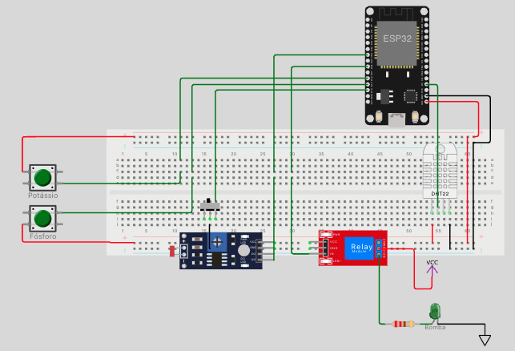

## Simulação no Wokwi e Interpretação dos Dados Seriais

### Prefixos das mensagens seriais

- `DATA:` — Linha de **dados dos sensores** enviados para integração com o sistema externo (Python, banco de dados etc).
  - Exemplo:  
    `DATA:M=E,P=1,K=1,PH=7.40,H=52.50`
    - Modo de decisão externo (E), Fósforo presente (1), Potássio presente (1), pH 7.40, Umidade 52.50%
- `LOG:` — Mensagens de **log, status, avisos e modo de decisão** do sistema embarcado.
  - Exemplo:  
    `LOG:[INFO] Irrigacao ATIVA (decisao EXTERNA).`
    `LOG:[MODO] Mudando para decisao LOCAL (ESP32)`

### Como funciona no Simulador

- **Botão Fósforo (P):** GPIO12 — Simula presença/ausência do nutriente.
- **Botão Potássio (K):** GPIO14 — Simula presença/ausência do nutriente.
- **Botão Modo de Decisão (Mode):** GPIO33 — Pressione para alternar entre lógica de irrigação externa (decisão pelo Python/Java/etc) e lógica local no ESP32.
- **LDR:** GPIO34 — Simula leitura analógica para pH.
- **DHT22:** GPIO27 — Mede umidade do solo (simulada).
- **Relé:** GPIO26 — Representa bomba de irrigação (ligada/desligada).
- **LED embutido:** GPIO2 — Indica status da bomba/irrigação.



> Sempre monitore o **Serial Monitor** no Wokwi para acompanhar o funcionamento do sistema, distinguir logs e leituras de dados, e depurar/testar sua integração Python.

---

### Modo de Decisão Externa

No modo de decisão externa, o sistema aguarda comandos via Serial para ativar ou desativar a irrigação. Para usar este modo:

1. **Configure o sistema para o modo externo:**
   - Pressione o botão de modo (GPIO33) até que o log indique:  
     `LOG:[MODO] Mudando para decisao EXTERNA (Python/Java/etc).`

2. **Conecte-se à Serial com `pyserial`:**
   - Instale o `pyserial` se ainda não tiver:  
     ```bash
     pip install pyserial
     ```
   - Conecte-se à porta serial do ESP32 usando `rfc2217`:  
     ```python
     import serial
     ser = serial.serial_for_url('rfc2217://localhost:4400', baudrate=115200)
     ```

3. **Envie comandos para controlar a irrigação:**
   - Para **ligar** a irrigação, envie o caractere `1`:  
     ```python
     ser.write(b'1')
     ```
   - Para **desligar** a irrigação, envie o caractere `0`:  
     ```python
     ser.write(b'0')
     ```

4. **Monitore os logs e dados no Serial Monitor:**
   - Exemplo de log ao ativar a irrigação:  
     `LOG:[INFO] Irrigacao ATIVA (decisao EXTERNA).`
   - Exemplo de log ao desativar a irrigação:  
     `LOG:[INFO] Irrigacao DESATIVADA (decisao EXTERNA).`

---

### Como executar no VS Code usando Wokwi e PlatformIO

1. **Instale as extensões necessárias**:
   - Certifique-se de que as extensões `PlatformIO IDE` e `Wokwi` estão instaladas no VS Code.  
     Você pode instalá-las diretamente na aba de extensões do VS Code.

2. **Abra o projeto no VS Code**:
   - Navegue até o diretório do simulador:
     ```bash
     cd sensores/simulador
     ```
   - Abra o diretório no VS Code:
     ```bash
     code .
     ```

3. **Compile e carregue o firmware**:
   - Na barra lateral do PlatformIO, clique em **Build** para compilar o código.

4. **Inicie o simulador no Wokwi**:
   - Clique no arquivo `diagram.json` e selecione **Start Wokwi Simulator**.
   - O Wokwi iniciará no simulador com o circuito.

5. **Teste o simulador**:
   - Use os botões e sensores no Wokwi para simular leituras e interagir com o sistema.
   - Monitore os logs e dados enviados pelo simulador no monitor serial.
